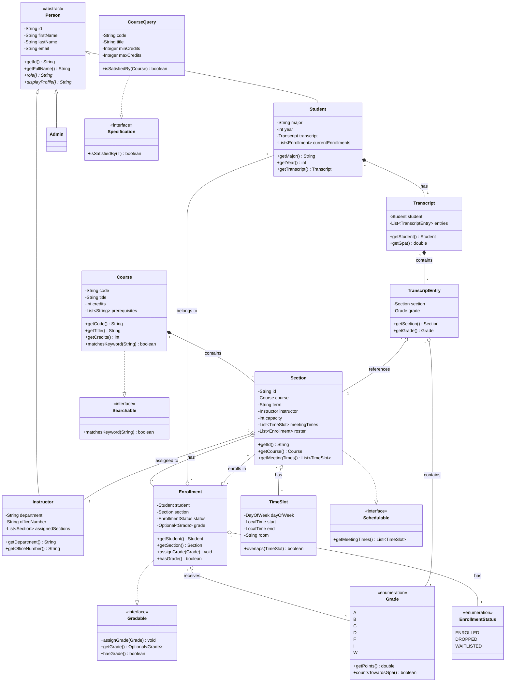

# University Course Registration System

Java app for university course registration. Handles enrollments, grading, and transcripts. Built with Clean Architecture principles.

## Features

- **Roles:** Students, Instructors, and Admins have different workflows
- **Registration Rules:**
    - Capacity check (with waitlist support)
    - Prerequisite validation
    - Schedule conflict detection
- **Admin Overrides:** Admins can bypass rules, but everything gets logged
- **Course Search:** Filter by code, title, credits, instructor, or time
- **Architecture:**
    - Model: Core entities (Student, Course, Section, etc.)
    - Repository: In-memory storage using Repository Pattern
    - Service: Business logic returns `Result<T>` instead of throwing exceptions
    - CLI: Command-line interface

## Project Structure

```
src/main/java/edu/uni/registration/
├── model/          # Entities (Student, Course, Section, etc.)
├── repository/     # Data access (Repository Pattern)
├── service/        # Business logic interfaces
├── service/impl/   # Service implementations
├── validation/     # Logic for conflicts, prerequisites, capacity
├── util/           # Helpers (Result<T>, AdminOverrideLog)
├── cli/            # Command Line Interface logic
└── Main.java       # Application entry point (DI & Seeding)
```

## How to Run

### Prerequisites
- Java JDK 11+
- Maven (or just use javac)

### Compile & Run

```bash
# Compile
javac -d bin -cp src/main/java src/main/java/edu/uni/registration/Main.java

# Run
java -cp bin edu.uni.registration.Main
```

### Tests

```bash
mvn test
```

Or run via your IDE.

## Demo Scenario

Pre-loaded test data:
- **Students:** S1-S6, **Instructors:** I1-I3, **Admin:** A1
- **Courses:** CS101 → CS102 → CS201, MATH101 → MATH102, PHYS101
- **Sections:** 10 sections (Fall 2023, Spring 2024)

### Quick Test Cases

**Capacity/Waitlist:** Try enrolling multiple students in `CS101-SMALL` (capacity: 1). First gets enrolled, next ones get waitlisted, then fails when waitlist is full.

**Prerequisites:** S1 can't take CS102 (no history). S3 can (passed CS101).

**Conflicts:** Enroll in overlapping time slots → should fail.

## UML Class Diagram

Class diagram showing all entities and relationships. I used PlantUML for this - the source is in `docs/class-diagram.puml` if you want to edit it.



**Key Relationships:**
- Inheritance: `Person` → `Student`/`Instructor`/`Admin`
- Interfaces: `Section` → `Schedulable`, `Course` → `Searchable`, `Enrollment` → `Gradable`
- Associations: Course-Section (1-*), Section-Enrollment (*), Student-Transcript (1-1), etc.

## Tests

Unit tests cover business logic, validation, and repositories. See [docs/test-results.md](docs/test-results.md) for full output.

**Test Coverage:**
- Admin workflows and overrides
- Capacity and waitlist validation
- Prerequisite checking
- Repository CRUD operations
- Schedule conflict detection
- Transcript and GPA calculation
- TimeSlot overlap detection

```bash
mvn test
# Or run specific test: mvn test -Dtest=TimeSlotTest
```

## Notes

- **No persistence:** Everything is in-memory. I didn't implement a database because this was meant to be a demo project. Adding JDBC or JPA would be straightforward though.

- **CLI could be better:** Error messages are pretty basic. Could add input validation and clearer prompts, but it works for testing the core logic.

- **Waitlist logic:** The auto-promotion when someone drops was tricky. Had to make sure it only promotes the first waitlisted student and updates their status correctly.

