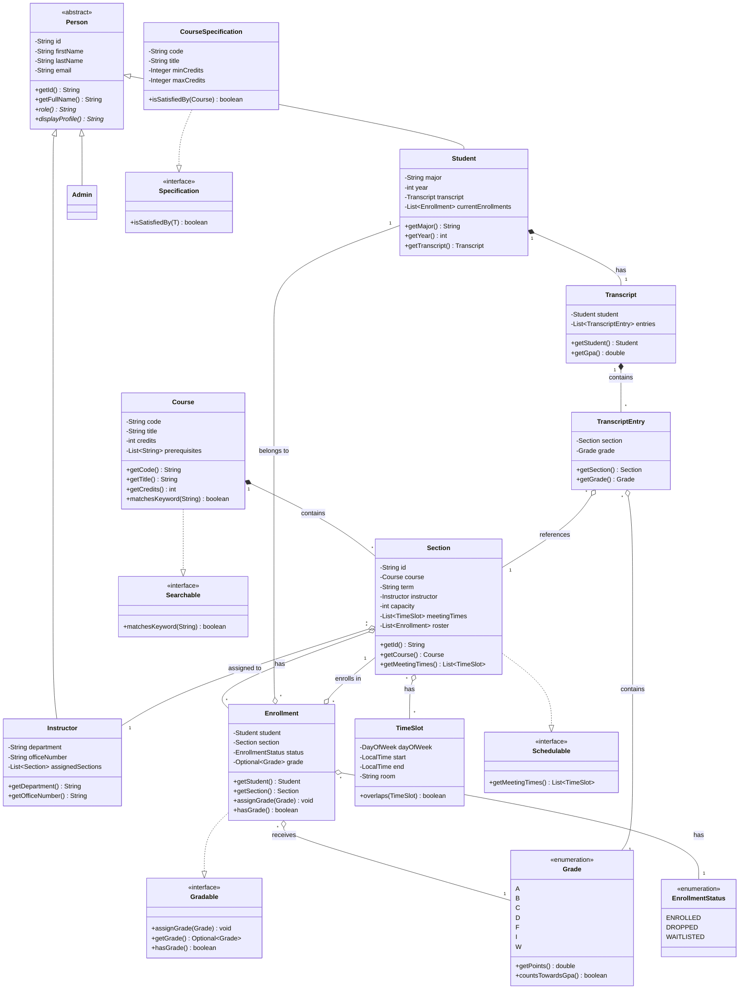

# University Course Registration System

A modular Java application modeling a university registration workflow. This system handles courses, sections, student enrollments, grading, and transcript generation with a focus on Clean Architecture and Object-Oriented principles.

## Features

- **Role-Based Access:** Distinct workflows for Students, Instructors, and Admins.
- **Registration Rules:**
    - **Capacity Check:** Prevents enrollment if section is full (supports Waitlist).
    - **Prerequisite Check:** Ensures students have passed required courses.
    - **Conflict Check:** Detects time overlaps in a student's schedule.
- **Admin Overrides:** Administrators can bypass rules (capacity/prerequisites) with mandatory logging.
- **Search Catalog:** Filter courses by code, title, credits, instructor, or time window.
- **Clean Architecture:**
    - **Model:** Core domain entities (Student, Course, Section).
    - **Repository:** In-memory data access abstraction (Generic Repository Pattern).
    - **Service:** Business logic layer returning `Result<T>` instead of throwing exceptions.
    - **CLI:** Simple command-line interface for user interaction.

## Project Structure

```
src/main/java/edu/uni/registration/
├── model/          # Entities (Student, Course, Section, etc.)
├── repository/     # Data access (Repository Pattern)
├── service/        # Business logic interfaces
├── service/impl/   # Service implementations
├── validation/     # Logic for conflicts, prerequisites, capacity
├── util/           # Helpers (Result<T>, AdminOverrideLog)
├── cli/            # Command Line Interface logic
└── Main.java       # Application entry point (DI & Seeding)
```

## How to Run

### Prerequisites
- Java JDK 11 or higher
- Maven (optional, or just use javac)

### Compilation & Execution (Manual)

1. **Compile:**
   Navigate to the project root and compile all Java files.
   ```bash
   javac -d bin -cp src/main/java src/main/java/edu/uni/registration/Main.java
   ```

2. **Run:**
   Execute the Main class from the bin directory.
   ```bash
   java -cp bin edu.uni.registration.Main
   ```

### Running Tests

The project includes JUnit tests for core business rules (Validation, Repositories, Logic).

```bash
mvn test
```
*(Or run via your IDE's test runner)*

## Design Decisions

- **Result Pattern:** Instead of cluttering logic with `try-catch` blocks, service methods return a `Result<T>` object that encapsulates either a success value or an error message.
- **Dependency Injection:** In `Main.java`, repositories and services are wired together manually, demonstrating understanding of IoC without relying on heavy frameworks like Spring.
- **Interface Segregation:** Services are defined by Interfaces (`CatalogService`, `RegistrationService`) to decouple implementation from contract.

## Demo Scenario (Pre-loaded Data)

When you run the app, the following data is automatically loaded:

- **Students:** `S1` (John Doe), `S2` (Jane Roe), `S3` (Mike Wazowski), `S4` (Sully Sullivan), `S5` (Peter Parker), `S6` (Tony Stark)
- **Instructors:** `I1` (Alice Smith), `I2` (Bob Jones), `I3` (Charlie Brown)
- **Admin:** `A1` (Super Admin)
- **Courses:** CS101, CS102, CS201, MATH101, MATH102, PHYS101 (with prerequisite chains)
- **Sections:** 10 sections across Fall 2023 and Spring 2024 terms

### Demo Flow: Capacity, Waitlist, and Admin Override

This demo shows how the system handles capacity limits, waitlists, admin overrides, and automatic waitlist promotion.

**Step 1: Student tries to enroll in a full section (should fail)**
1. Login as **Student (S1)** → Choose option `1`
2. Enter student ID: `S1`
3. Choose option `2` (Enroll in Section)
4. Enter section ID: `CS101-SMALL` (capacity: 1, waitlist: 2)
5. **Result:** ✅ Success! S1 is enrolled (first student)

**Step 2: Another student enrolls (goes to waitlist)**
1. Login as **Student (S2)** → Choose option `1`
2. Enter student ID: `S2`
3. Choose option `2` (Enroll in Section)
4. Enter section ID: `CS101-SMALL`
5. **Result:** ✅ Success! S2 is waitlisted (section is full)

**Step 3: Third student enrolls (also waitlisted)**
1. Login as **Student (S3)** → Choose option `1`
2. Enter student ID: `S3`
3. Choose option `2` (Enroll in Section)
4. Enter section ID: `CS101-SMALL`
5. **Result:** ✅ Success! S3 is waitlisted

**Step 4: Fourth student tries to enroll (should fail - waitlist full)**
1. Login as **Student (S4)** → Choose option `1`
2. Enter student ID: `S4`
3. Choose option `2` (Enroll in Section)
4. Enter section ID: `CS101-SMALL`
5. **Result:** ❌ Failed! "Section and waitlist are full"

**Step 5: Admin override enrollment (should succeed)**
1. Login as **Admin (A1)** → Choose option `3`
2. Enter admin ID: `A1`
3. Choose option `5` (Override Enrollment - Force Add)
4. Enter student ID: `S4`
5. Enter section ID: `CS101-SMALL`
6. Enter reason: `Special permission granted`
7. **Result:** ✅ Success! S4 is forcefully enrolled (bypasses capacity)

**Step 6: Student drops → Waitlist auto-promotion**
1. Login as **Student (S1)** → Choose option `1`
2. Enter student ID: `S1`
3. Choose option `3` (Drop Section)
4. Enter section ID: `CS101-SMALL`
5. **Result:** ✅ Success! S1 dropped, and S2 (first waitlisted) is automatically promoted to ENROLLED

**Step 7: Verify the results**
1. Login as **Student (S2)** → Choose option `1`
2. Enter student ID: `S2`
3. Choose option `4` (View Schedule)
4. **Result:** You should see `CS101-SMALL` in the schedule (promoted from waitlist)

### Additional Demo Scenarios

**Prerequisite Check:**
- Try enrolling `S1` (no history) in `CS102-01` → Should fail: "Student has not completed prerequisites"
- Try enrolling `S3` (passed CS101) in `CS102-01` → Should succeed

**Schedule Conflict:**
- Enroll `S1` in `CS101-01` (Mon/Wed 9:00-10:30)
- Try enrolling `S1` in `MATH101-01` (Mon 11:00-12:30) → Should succeed (no conflict)
- Try enrolling `S1` in another section with overlapping times → Should fail: "time conflict"

## UML Class Diagram

The project includes a comprehensive UML class diagram showing the relationships between all core entities, interfaces, and their associations.



**Key Relationships:**
- **Inheritance:** `Person` → `Student`/`Instructor`/`Admin`
- **Implementation:** `Section` implements `Schedulable`, `Course` implements `Searchable`, `Enrollment` implements `Gradable`, `CourseSpecification` implements `Specification<Course>`
- **Associations:** `Course`-`Section` (1-*), `Section`-`Enrollment` (*), `Student`-`Transcript` (1-1), `Section`-`Instructor` (*-1), `Section`-`TimeSlot` (*)

> **Note:** A detailed PlantUML version is also available at `docs/class-diagram.puml` for offline viewing.

## Test Results

The project includes comprehensive unit tests covering core business logic, validation rules, and repository operations.

**Test Results Documentation:** See [docs/test-results.md](docs/test-results.md) for detailed test execution output.

### Test Coverage

The test suite includes:

- **Admin Workflow Tests** - Admin override functionality and capacity management
- **Capacity Validator Tests** - Section capacity and waitlist validation
- **Prerequisite Validator Tests** - Course prerequisite checking logic
- **Repository Tests** - CRUD operations for all repository implementations
- **Schedule Conflict Checker Tests** - Time slot overlap detection
- **Student Transcript Tests** - Transcript retrieval and GPA calculation
- **Time Slot Tests** - TimeSlot model validation and overlap detection
- **Transcript Tests** - Transcript entry management and GPA calculation

### Running Tests

```bash
# Run all tests
mvn test

# Run specific test class
mvn test -Dtest=TimeSlotTest

# Run tests with verbose output
mvn test -X
```

For complete test execution output and results, refer to [docs/test-results.md](docs/test-results.md).

